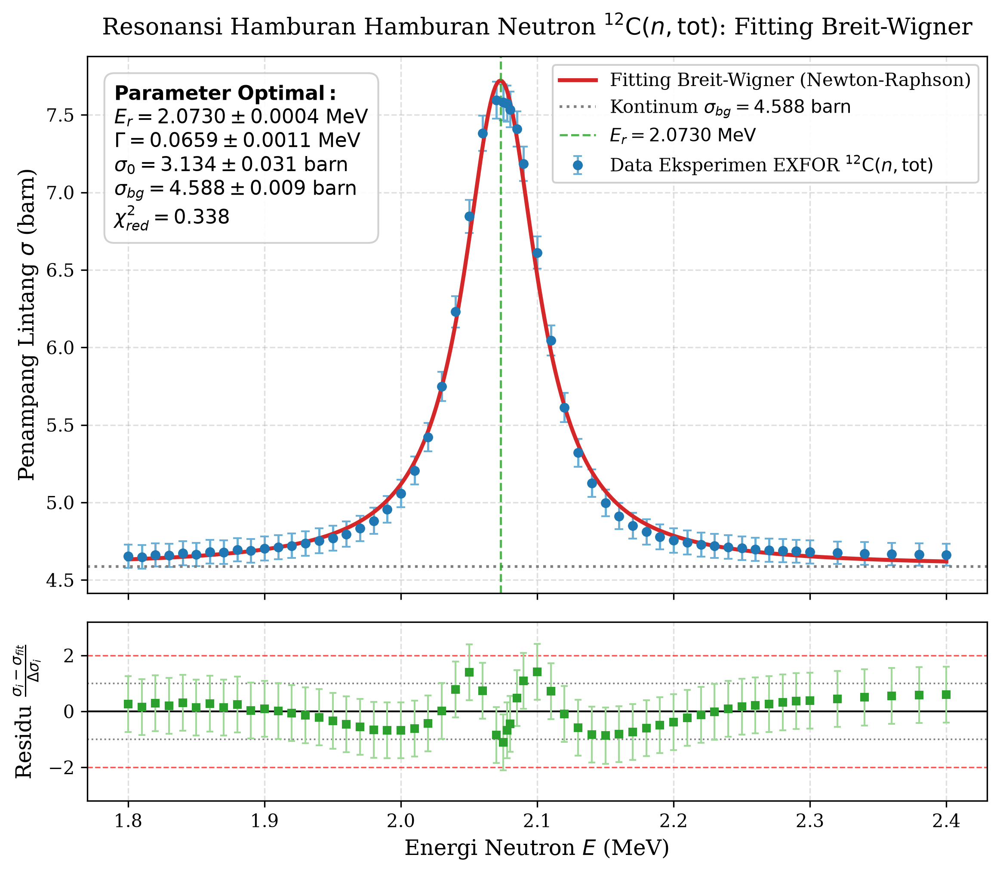
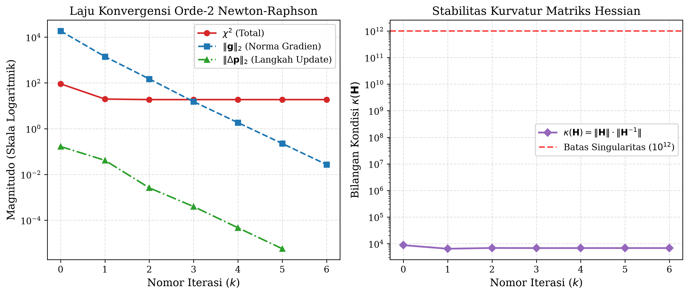
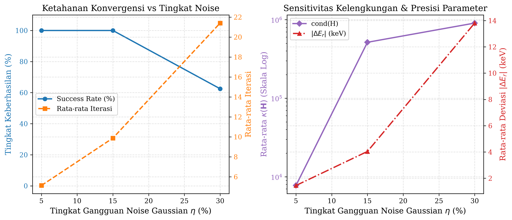
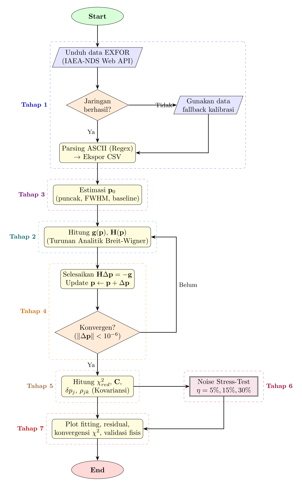

# Fitting Resonansi Hamburan Neutron $^{12}\text{C}(n,\text{tot})$ Model Breit-Wigner Menggunakan Newton-Raphson Multivariat

[](https://www.python.org/)
[](LICENSE)
[](resonance_breit_wigner_fitting.ipynb)
[](exfor_c12_resonance.csv)
[](PRD/)

Repository ini berisi implementasi komputasi numerik, analisis statistik, visualisasi, dan laporan praktikum untuk **Studi Kasus 8: Fitting Resonansi Hamburan Neutron $^{12}\text{C}(n,\text{tot})$ Model Breit-Wigner Menggunakan Newton-Raphson Multivariat**.

---

## 👥 Tim Penyusun (Kelompok H)
- **Airin Khairunnisa Nur Raerah** (NIM. 182241045)
- **Hendra Maulana** (NIM. 182241043)

*Laboratorium Fisika Komputasi, Departemen Fisika, Fakultas Sains dan Teknologi, Universitas Airlangga (2026)*

---

## 📌 Tautan Cepat Berkas Utama
- 📓 **Jupyter Notebook Interaktif**: [`resonance_breit_wigner_fitting.ipynb`](resonance_breit_wigner_fitting.ipynb)
- 📊 **Datasheet CSV Data Eksperimen**: [`exfor_c12_resonance.csv`](exfor_c12_resonance.csv)
- 📑 **Dokumen Kebutuhan Produk (PRD)**: Folder [`PRD/`](PRD/)
- 📄 **Dokumen Laporan Lengkap (PDF)**: [`Laporan/main.pdf`](Laporan/main.pdf)
- 📜 **Source Code LaTeX Laporan**: Folder [`Laporan/`](Laporan/)

---

## 🔬 Deskripsi Pemodelan Fisis
Fenomena pembentukan inti majemuk $^{13}\text{C}^*$ melalui penyerapan neutron pada target $^{12}\text{C}$ dimodelkan menggunakan rumus penampang lintang resonansi Breit-Wigner satu tingkat (*Single-Level Breit-Wigner / SLBW*):
$$\sigma(E; \mathbf{p}) = \sigma_{bg} + \sigma_0 \frac{(\Gamma/2)^2}{(E - E_r)^2 + (\Gamma/2)^2}$$
dengan vektor parameter $\mathbf{p} = [E_r, \Gamma, \sigma_0, \sigma_{bg}]^T$.

Optimasi pencocokan kurva (*non-linear curve fitting*) terhadap data eksperimen IAEA-NDS EXFOR (Entry 10224002, Cierjacks et al., 1968) diselesaikan menggunakan metode **Newton-Raphson Multivariat** dengan formulasi analitik eksak matriks gradien $\mathbf{g}(\mathbf{p})$ dan matriks kelengkungan Hessian Gauss-Newton $\mathbf{H}(\mathbf{p}) = 2\mathbf{J}^T\mathbf{W}\mathbf{J}$.

---

## 🚀 Hasil Komputasi Utama
- **Kecepatan Konvergensi**: Mencapai konvergensi penuh hanya dalam **6 langkah iterasi** dengan toleransi henti ganda $\varepsilon = 10^{-6}$.
- **Kualitas Fitting**: Nilai *reduced chi-square* $\chi^2_{red} = 0.3383$ ($\nu = 55$ derajat kebebasan), menunjukkan fitting sangat presisi tanpa *overfitting*.
- **Parameter Resonansi Optimal**:
  - Energi Resonansi Pusat ($E_r$): $2.073019 \pm 0.000379\text{ MeV}$ (Galat relatif $0.018\%$)
  - Lebar Resonansi FWHM ($\Gamma$): $0.065895 \pm 0.001148\text{ MeV}$ (Galat relatif $1.74\%$)
  - Amplitudo Puncak ($\sigma_0$): $3.133715 \pm 0.030648\text{ barn}$ (Galat relatif $0.98\%$)
  - Kontinum Hamburan Latar ($\sigma_{bg}$): $4.587609 \pm 0.008926\text{ barn}$ (Galat relatif $0.19\%$)
- **Validasi terhadap Standar Internasional ENDF/B-VIII.0**:
  - $E_r^{lit} = 2.078000\text{ MeV}$
  - Diskrepansi mutlak: $0.004981\text{ MeV} = 4.98\text{ keV}$
  - Deviasi relatif: **$0.2397\%$** ($< 0.5\%$).

---

## 📊 Galeri Visualisasi Hasil

| Fitting Kurva Resonansi & Residu | Profil Konvergensi Orde-Dua |
| :---: | :---: |
|  |  |

| Uji Ketahanan Derau Monte Carlo | Diagram Alir Pipeline Komputasi |
| :---: | :---: |
|  |  |

---

## 💻 Panduan Menjalankan Notebook Lokal

### 1. Kloning Repository
```bash
git clone https://github.com/xysilverberg/Neutron-Resonance-Breit-Wigner.git
cd Neutron-Resonance-Breit-Wigner
```

### 2. Instalasi Dependensi
Pastikan Python 3.9+ telah terpasang di sistem lokal Anda:
```bash
pip install -r requirements.txt
```

### 3. Menjalankan Jupyter Notebook
```bash
jupyter notebook resonance_breit_wigner_fitting.ipynb
```
atau buka langsung menggunakan VS Code / JupyterLab.

---

## 📑 Dokumen Spesifikasi Kebutuhan Produk (PRD)

Seluruh rancangan matematis, penurunan kalkulus, heuristik fisis, logika percabangan, algoritma matriks, dan skenario pengujian termaktub lengkap dalam direktori [`PRD/`](PRD/):

| No. | Dokumen PRD | Komponen Pipeline | Ruang Lingkup & Fokus Utama |
| :---: | :--- | :--- | :--- |
| **0** | [PRD Arsitektur Notebook](PRD/PRD_Arsitektur_Jupyter_Notebook.md) | Blueprint Notebook | Standar struktur sel, instalasi dependensi, narasi fisis markdown, dan eksekusi interaktif. |
| **1** | [PRD Tahap 0](PRD/PRD_Tahap0_Pseudocode_Flowchart_TikZ.md) | Desain Algoritma | Diagram alir TikZ, struktur kontrol perulangan, dan pseudocode algoritma utama. |
| **2** | [PRD Tahap 1](PRD/PRD_Tahap1_Akuisisi_Data_Pipeline_CSV.md) | Pipeline Data | Akuisisi IAEA-NDS EXFOR, parser regex ASCII, pemotongan rentang energi $1.8-2.4\text{ MeV}$, dan ekspor CSV. |
| **3** | [PRD Tahap 2](PRD/PRD_Tahap2_Gradien_Hessian.md) | Kalkulus Analitik | Formulasi analitik Jacobian $\mathbf{J}$, Gradien $\mathbf{g}$, dan Hessian Gauss-Newton $\mathbf{H}$. |
| **4** | [PRD Tahap 3](PRD/PRD_Tahap3_Initial_Guess.md) | Heuristik Tebakan Awal | Ekstraksi otomatis tebakan parameter fisis $\mathbf{p}_0 = [E_r^{(0)}, \Gamma^{(0)}, \sigma_0^{(0)}, \sigma_{bg}^{(0)}]^T$. |
| **5** | [PRD Tahap 4](PRD/PRD_Tahap4_Newton_Raphson_Solver.md) | Solver Numerik | Mesin solver $\mathbf{H}\Delta\mathbf{p} = -\mathbf{g}$, kriteria henti $\varepsilon = 10^{-6}$, dan bilangan kondisi $\kappa(\mathbf{H})$. |
| **6** | [PRD Tahap 5](PRD/PRD_Tahap5_Statistik_Kovariansi.md) | Inferensi Statistik | Kelayakan $\chi^2_{red}$, matriks kovariansi $\mathbf{C} = 2\mathbf{H}^{-1}$, matriks korelasi $\boldsymbol{\rho}$, dan residu terbobot. |
| **7** | [PRD Tahap 6](PRD/PRD_Tahap6_Noise_Stress_Test.md) | Uji Ketahanan Derau | Simulasi Monte Carlo derau Gaussian ($5\%, 15\%, 30\%$) dan identifikasi titik singularitas. |
| **8** | [PRD Tahap 7](PRD/PRD_Tahap7_Visualisasi.md) | Visualisasi Publikasi | Pembuatan grafik ganda resolusi tinggi untuk naskah publikasi ilmiah. |

---

## 📚 Struktur Berkas Repository
```text
├── PRD/                                  # Folder Dokumen Spesifikasi Kebutuhan Produk (PRD)
│   ├── README.md                         # Indeks & diagram alir keterhubungan PRD
│   ├── PRD_Arsitektur_Jupyter_Notebook.md
│   ├── PRD_Tahap0_Pseudocode_Flowchart_TikZ.md
│   ├── PRD_Tahap1_Akuisisi_Data_Pipeline_CSV.md
│   ├── PRD_Tahap2_Gradien_Hessian.md
│   ├── PRD_Tahap3_Initial_Guess.md
│   ├── PRD_Tahap4_Newton_Raphson_Solver.md
│   ├── PRD_Tahap5_Statistik_Kovariansi.md
│   ├── PRD_Tahap6_Noise_Stress_Test.md
│   └── PRD_Tahap7_Visualisasi.md
├── resonance_breit_wigner_fitting.ipynb  # Notebook Jupyter mandiri & interaktif
├── exfor_c12_resonance.csv               # Datasheet data eksperimen IAEA EXFOR
├── build_and_run_notebook.py             # Script otomatis perakit & pengeksekusi notebook
├── tahap1_data_pipeline.py               # Modul akuisisi & parsing data EXFOR
├── tahap2_analytic_derivatives.py        # Modul Jacobian, Gradien & Hessian analitik
├── tahap3_initial_guess.py               # Modul heuristik fisis tebakan awal
├── tahap4_newton_raphson_solver.py       # Modul solver Newton-Raphson multivariat
├── tahap5_statistical_analysis.py        # Modul kovariansi, korelasi & chi2
├── tahap6_stress_test.py                 # Modul simulasi Monte Carlo ketahanan derau
├── tahap7_visualization.py               # Modul plotting visualisasi publikasi
├── flowchart_pipeline.png                # Gambar alur algoritma (Tahap 1 - 7)
├── resonance_fitting_plot.png            # Plot hasil fitting kurva & residu
├── convergence_metrics_plot.png          # Plot metrik konvergensi kuadratik
├── noise_stress_test_plot.png            # Plot uji ketahanan derau Monte Carlo
├── Laporan/                              # Folder naskah laporan praktikum LaTeX
│   ├── main.tex                          # Naskah utama LaTeX
│   ├── main.pdf                          # Hasil kompilasi laporan PDF (23 halaman)
│   ├── references.bib                    # Bibliografi jurnal internasional Q1
│   ├── figures/                          # Gambar aset laporan
│   └── sections/                         # Berkas per seksi dokumen
└── requirements.txt                      # Daftar pustaka Python yang dibutuhkan
```

